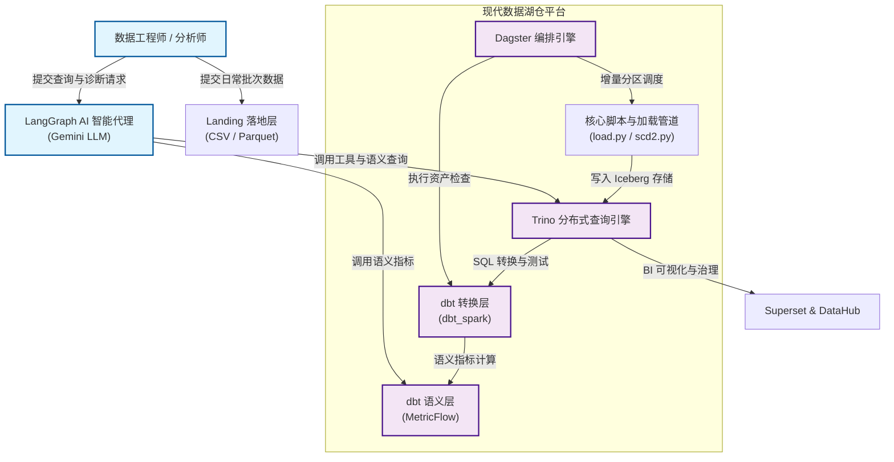

# 1. 概述 (System Overview)

## 1. 业务价值与愿景

欢迎来到 **data-lakehouse-poc** 项目。在现代企业数据架构中，如何将海量、多源、异构的数据高效转换为高质量的决策资产，是每一家数据驱动型企业面临的核心挑战。本项目正是为了应对这一挑战而构建的现代化开源数据湖仓（Lakehouse）概念验证（POC）平台。

通过有机结合 Apache Iceberg 的开放式 ACID 存储表格式、Trino 的分布式超高速 SQL 查询引擎、dbt 的声明式数据转换与语义层（MetricFlow）、Dagster 的健壮流水线编排，以及基于 LangGraph 和 Google Gemini 的 AI 智能诊断代理，本项目为团队打造了一个兼具高性能、高可靠性与智能化运维的端到端数据湖仓样板间。

---

## 2. 系统上下文与 C4 架构 (System Context)

为了让架构意图一目了然，我们首先通过 C4 模型中的 **System Context（系统上下文）** 图来审视本系统与外部环境及各类参与者之间的交互关系。

如上图所示，整个平台以 **Trino + Iceberg** 为数据底座，上层通过 **Dagster** 驱动日常增量批次加载与 dbt 建模，同时深度集成 **LangGraph AI 代理**，为用户提供自然语言交互、自动故障排查和数据质量校验能力。

---

## 3. 核心功能模块清单

为了实现湖仓一体的流畅运转，项目在代码结构上划分为以下几个核心领域模块：

| 模块名称 | 路径指引 | 核心职责 | 对应技术栈 |
| :--- | :--- | :--- | :--- |
| **编排引擎** | `orchestration/` | 基于 UTC 日期分区的端到端流水线调度、dbt 资产集成与资产检查 | Dagster, dagster-dbt |
| **转换与建模** | `dbt_spark/` | 奖章架构（ODS → Staging → Dimension/Fact → DWS/ADS）的 SQL 转换与测试 | dbt-core, Spark, Iceberg |
| **语义层** | `dbt_semantic/` | 业务实体、维度和度量（Metrics）的统一语义定义 | MetricFlow, dbt |
| **智能代理** | `agent/` | 多角色 AI 智能代理、指数退避重试、多轮对话与自动化故障诊断 | LangGraph, Google Gemini |
| **运维与加载** | `scripts/` | 批次数据加载、缓慢变化维（SCD2）演进、等价性验证及合规检查 | Python, Trino Client |
| **安全与治理** | `trino/`, `datahub/` | 细粒度访问控制规则（行/列级安全）、元数据血缘与 PII 隐私标记 | Trino Security, DataHub |

---

## 4. 技术选型决策与权衡

在技术选型过程中，我们遵循了以下几个核心设计原则：
1. **开放标准优先**: 存储采用 Apache Iceberg，彻底避免厂商锁定，支持多种计算引擎共享数据湖。
2. **声明式与可观测**: 采用 Dagster 进行声明式资产编排，将 dbt 测试直接映射为资产检查，确保数据质量透明可见。
3. **AI 赋能运维**: 针对湖仓运维复杂度高的痛点，创新性地引入 LangGraph + Gemini 代理，实现故障的自动化诊断与语义级指标查询。
