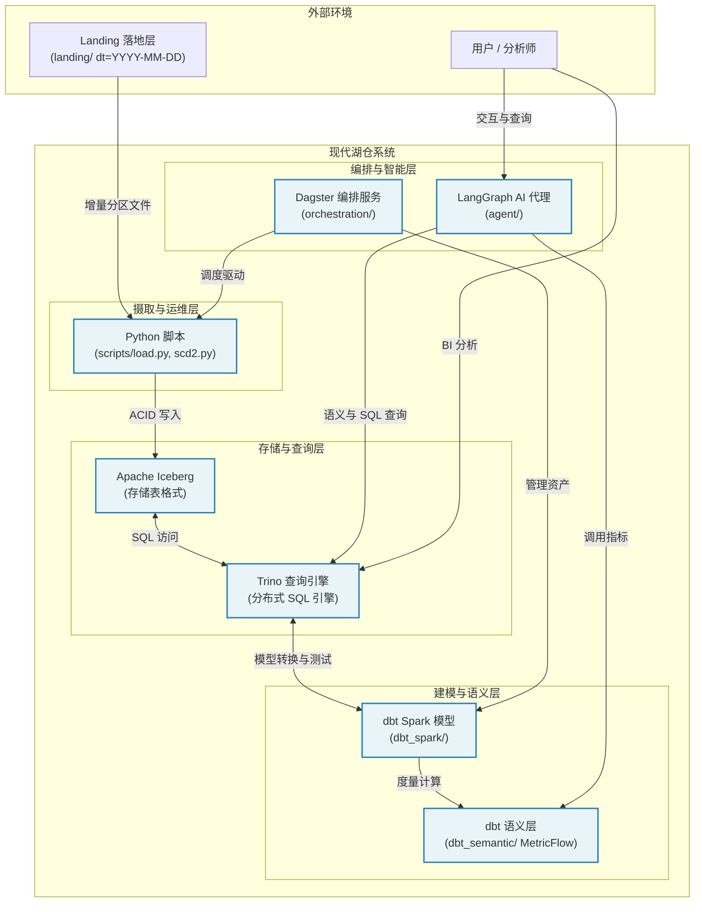

# 2. 架构 (System Architecture)

## 1. 架构演进与设计哲学

在构建 **data-lakehouse-poc** 时，我们的核心目标是将传统数据仓库的严谨性与现代数据湖的灵活性完美融合。系统采用了 **Medallion Architecture（奖章架构）** 作为数据流转的蓝图，并通过 **Dagster** 编排引擎与 **dbt** 转换工具链形成闭环。

为了让读者清晰理解各层级与组件之间的协作关系，我们通过以下 **C4 Container（容器）** 架构图来展示系统的宏观容器布局：

---

## 2. 核心模块职责与组件划分

系统内部各容器各司其职，通过标准的协议和接口紧密协作：

1. **存储与计算底座 (`Trino` + `Iceberg`)**:
   - 采用 Apache Iceberg 作为底层表格式，提供时间旅行（Time Travel）、快照隔离与高性能分区裁剪。
   - Trino 作为统一的分布式 SQL 查询引擎，向上支撑 dbt 转换、BI 报表及 AI Agent 的结构化查询。

2. **数据转换流水线 (`dbt_spark`)**:
   - 严格遵循奖章架构分层：
     - **ODS 原始层**: `ods.*_raw`（追加写日志）与 `ods.*`（当前状态）。
     - **Staging 清洗层 (`stg_`)**: 清洗脏数据、统一类型和命名规范。
     - **Dimension & Fact (`dim_`, `fact_`)**: 构建维度表（如支持 SCD2 历史追踪的 `dim_product`, `dim_customer`）与事实表（`fact_orders`）。
     - **DWS & ADS 汇总层**: 计算每日收入汇总（`dws_daily_revenue`）与品类收入排名（`ads_category_revenue_rank`）。

3. **语义层 (`dbt_semantic`)**:
   - 基于 MetricFlow 机制定义实体、维度和度量，屏蔽底层复杂的 SQL JOIN 细节，确保企业指标口径唯一。

4. **智能诊断代理 (`agent`)**:
   - 封装了 LangGraph 工作流，通过多角色 Arm（`semantic`, `raw`, `diagnose`, `verify`）实现对湖仓运行状态的自主巡检、故障诊断与自然语言问答。

---

## 3. 设计决策与权衡分析

在架构设计中，我们作出了以下几项关键权衡：
- **为什么选择 dbt-trino 结合 dbt-spark？** 
  虽然 Spark 适合重型批处理，但 Trino 在交互式查询和 MetricFlow 语义层支持上表现卓越。通过在不同阶段合理分配计算引擎，兼顾了吞吐量与查询响应速度。
- **为什么在 Dagster 中将 dbt 测试映射为资产检查（Asset Checks）？**
  相比传统的独立测试任务，将数据质量检查作为资产的固有属性，能够在数据资产流转时自动触发告警，极大提升了数据可观测性。
