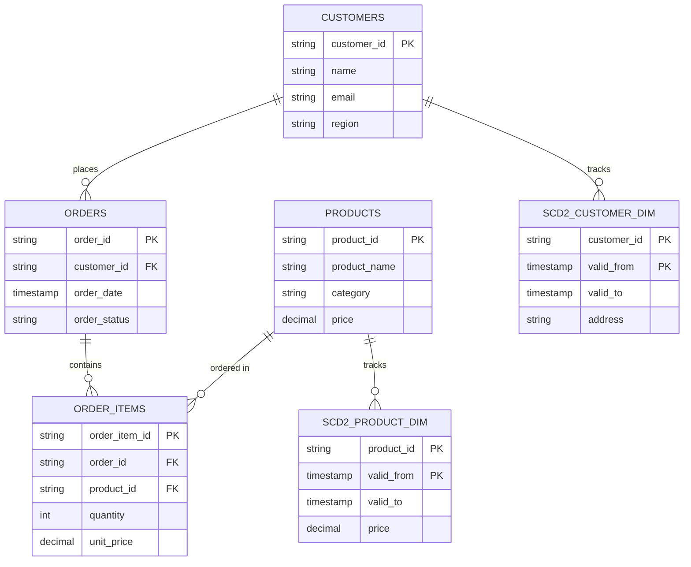

# 6. 数据库概览 (Database Overview & ER Model)

## 1. 存储设计与湖仓分层

本项目基于 **Apache Iceberg** 开放式表格式构建，通过 Trino Catalog 进行逻辑空间隔离。整个数据库体系划分为多个关键层级（Catalog）：

- **`ods`**: 贴源数据层。包含 `orders_raw`, `order_items_raw`, `customers_raw`, `products_raw`（追加写日志分区表）以及对应的当前状态表。
- **`scd2`**: 缓慢变化维层。包含 `dim_product`, `dim_customer`，完整记录维度属性随时间演进的历史版本。
- **`stg`**: 规范清洗层。包含 `stg_orders`, `stg_order_items`, `stg_customers`, `stg_products`。
- **`fact`**: 核心事实层。包含 `fact_orders`（订单明细事实表）。
- **`dws` / `ads`**: 汇总与应用层。包含 `dws_daily_revenue` 与 `ads_category_revenue_rank`。

---

## 2. 实体关系图 (ER Model)

为了直观展示核心实体（订单、订单明细、客户、产品）之间的关联关系，我们通过以下 Mermaid ER 图进行建模：

---

## 3. 核心表结构说明

1. **`ods.orders_raw` / `ods.orders`**:
   - 记录每日从 Landing 落地层摄取的原始订单事件流及当前快照。
2. **`scd2.dim_product` / `scd2.dim_customer`**:
   - 采用 SCD Type 2 模式，利用 `valid_from` 和 `valid_to` 联合主键或时间区间，支持任意历史时间点的状态回溯与准确关联。
3. **`fact_orders`**:
   - 汇聚订单、明细、客户与产品维度，是计算每日收入汇总（`dws_daily_revenue`）与品类排名的基础。
